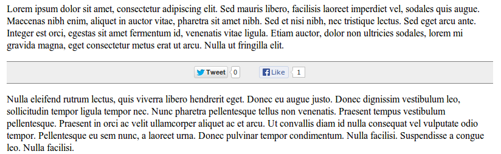

<h2>Table of Contents</h2>

<ul>
<li><a href="#sec-1">1. Description</a>
<ul>
<li><a href="#sec-1-1">1.1. Features</a></li>
</ul>
</li>
<li><a href="#sec-2">2. Rationale</a></li>
<li><a href="#sec-3">3. Example</a></li>
<li><a href="#sec-4">4. Quickstart</a>
<ul>
<li><a href="#sec-4-1">4.1. Grab the mimified code</a></li>
<li><a href="#sec-4-2">4.2. Insert the container div</a></li>
<li><a href="#sec-4-3">4.3. Invoke the script</a></li>
<li><a href="#sec-4-4">4.4. Style the container</a></li>
<li><a href="#sec-4-5">4.5. Enjoy!</a></li>
</ul>
</li>
<li><a href="#sec-5">5. Configuration</a></li>
<li><a href="#sec-6">6. Development</a></li>
<li><a href="#sec-7">7. Default Styles</a>
<ul>
<li><a href="#sec-7-1">7.1. Example A</a></li>
<li><a href="#sec-7-2">7.2. Example B</a></li>
</ul>
</li>
<li><a href="#sec-8">8. Contributions</a></li>
</ul>

# Description

*Help Me Share* is a small javascript utility which adds *Share* buttons for
various services, i.e. *twitter* and *facebook*.

It embedded the native twitter and facebook buttons and does not use any
intermediary. As a result the sharing statistics are not given away to any
third-party except to the service that user clicked.

## Features

-   Each supported sharing service has a *plugin*.
    
    -   Currently there are only twitter and facebook plugins.

-   You can decide which plugins to use.

-   You can specify various configuration options for the plugins.

# Rationale

There is a lot of sharing services one may what to use. It is troublesome
to include all the buttons you may want manually. Hence, the project. You
need include one `
`, the javascript and call a function which will
create the buttons you want.

It is intended as a facility to simplify embedding and configuring third
party sharing services on your website.

It is worth noting that there are some alternatives, most notably
[Share This](http://en.wikipedia.org/wiki/ShareThis).
One feature that differentiate `Help Me Share` is that it uses the
sharing services directly. For instance, if your user clicks on the `Like`
button the request will go directly to facebook. There are no other
intermediaries to gather your visitors data.

Please see an example (See section ) or go straight to the quickstart (See section ).

# Example

An example of a custom style, live demo at <http://igor.kupczynski.info/>.

# Quickstart

## Grab the mimified code

Download if from: 
<https://raw.github.com/puszczyk/help-me-share/master/resources/stable/hms.min.js>

## Insert the container div

Put the following tag in the place where you want the buttons to show.

    

     

## Invoke the script

Include the script near the end of your page, e.g. just before the closing
`</body>` tag and configure the options.

    
    

The function `help_me_share.code.init` does the job of creating buttons. It
needs two arguments:

-   Id of the container,

-   Map of configuration options. For quickstart it is sufficient to give
    your twitter account name.

## Style the container

You need either to provide your own style or use one of the defaults. The
defaults can be downloaded from the following locations:

-   <https://raw.github.com/puszczyk/help-me-share/master/resources/public/css/hms.css>

-   <https://raw.github.com/puszczyk/help-me-share/master/resources/public/css/hms-fixed.css>

And then included on the page within the meta tag:

    <link rel="stylesheet" type="text/css" href="css/hms.css"/>

## Enjoy!

Twitter button clicked.

Facebook button clicked.

# Configuration

`TODO`

# Development

`TODO`

# Default Styles

## Example A

Default style - button are embedded on a fixed position in relation to the
site content.

## Example B

Alternative style - buttons are on the a fixed position in relation to
the browser frame and appear to be floating over the site content.

# Contributions

We are on EPL, please feel free to fork this repository and contribute. You
can also raise any issues or suggest improvements though the *issues*
interface <https://github.com/puszczyk/help-me-share/issues>.
